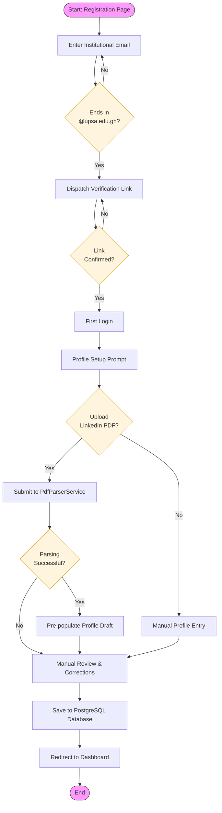

# SkillBridge GH Flowchart Diagram (Figure 3.1)

This document provides the detailed prompt and technical specification for generating the Flowchart Diagram for the Graduate Onboarding and Profile Automation process.

## Diagram Description
The flowchart illustrates the logical sequence of the core graduate onboarding workflow, highlighting the @upsa.edu.gh email validation, email verification, and the LinkedIn PDF parsing automation logic.

## Mermaid.js Implementation

## Detailed Prompt for Visual Generation
If using a professional diagramming tool like LucidChart, Draw.io, or Visio, use the following specifications:

> **Prompt:** Create a technical flowchart for the "SkillBridge GH Graduate Onboarding Process".
> 1. **Start/End:** Use rounded capsules for "Start" and "End".
> 2. **Decision Points:** Use diamond shapes for:
>    - "Ends in @upsa.edu.gh?"
>    - "Link Confirmed?"
>    - "Upload LinkedIn PDF?"
>    - "Parsing Successful?"
> 3. **Process Steps:** Use rectangles for:
>    - "Enter Institutional Email"
>    - "Dispatch Verification Link"
>    - "First Login"
>    - "Profile Setup Prompt"
>    - "Submit to PdfParserService"
>    - "Pre-populate Profile Draft"
>    - "Manual Review & Corrections"
>    - "Save to PostgreSQL Database"
>    - "Redirect to Dashboard"
> 4. **Logic Paths:** 
>    - Ensure clear "Yes/No" labels on all decision branches.
>    - Show the loop back for invalid email and unconfirmed verification links.
>    - Show both the PDF automation path and the manual entry path merging at "Manual Review".
> 5. **Style:** Clean, professional engineering flowchart aesthetic. Use high-contrast lines and clear sans-serif text.
